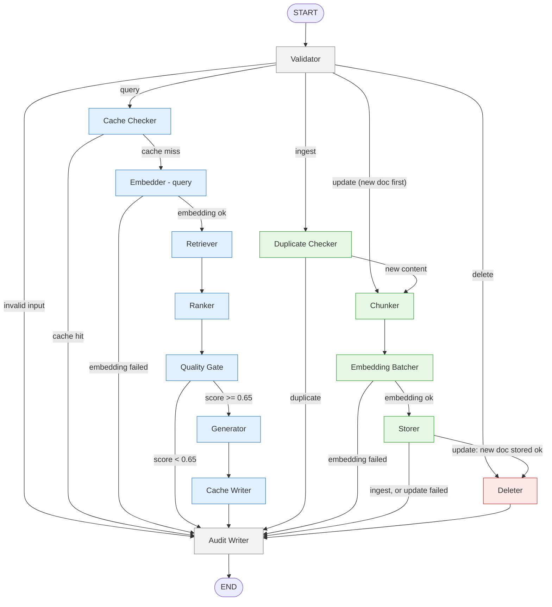
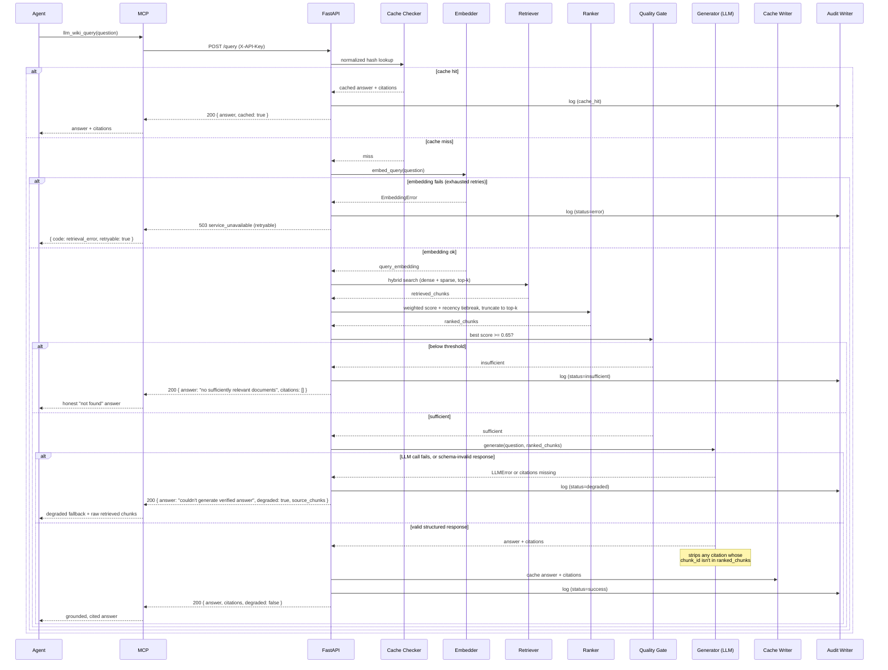

# LLM Wiki

A production-grade RAG knowledge base for enterprise SOPs. It ingests company
documents (PDF, DOCX, TXT, Markdown), chunks and embeds them, stores them in a
vector database, and answers natural-language questions with grounded, cited
responses traceable to exact source sections. Managed by a single admin.
Queryable by humans and AI agents via MCP. Built with LangGraph, FastAPI,
Qdrant, and PostgreSQL.

---

## Architecture

Single LangGraph `StateGraph` shared by all four operations (query, ingest,
delete, update) — one graph, one state schema, one checkpointer, four paths
through it. 14 nodes. 4 PRD-specified routing decisions, plus 4 additional
gap-fill branches required to make failure handling actually route correctly
(a rejected/failed node has to go *somewhere* other than crashing the next
node — see inline comments in `app/graph/routing.py`).



**Update path's fortified order**, shown above via `Storer`'s branch: the new
document is ingested and stored *first* (going through the full ingest path —
`Chunker → Embedding Batcher → Storer`). Only after that succeeds does
`Storer` route to `Deleter` to remove the *old* document. If the new document
fails to store, the old one is left in place untouched — a temporary
duplicate is preferable to a hole where neither version exists (D-2).

### Node inventory (14)

| # | Node | Real work |
|---|------|-----------|
| 1 | Validator | Input validation, file type/size checks, routes by `operation_type` |
| 2 | Cache Checker | Normalized-hash lookup in Postgres cache |
| 3 | Embedder (query) | Nomic dense embedding of the question |
| 4 | Retriever | Hybrid dense+sparse (BM25) search against Qdrant, top-k |
| 5 | Ranker | Weighted score combination (0.7 dense / 0.3 sparse) + recency tiebreak, truncates to top-k |
| 6 | Quality Gate | Best score vs. 0.65 threshold |
| 7 | Generator | Claude Sonnet, formatter-only, 3-layer grounding verification |
| 8 | Cache Writer | Writes answer + citations to Postgres cache |
| 9 | Duplicate Checker | Content-hash dedup check |
| 10 | Chunker | Structure-aware splitting (PDF/DOCX/TXT/MD), context enrichment |
| 11 | Embedding Batcher | Batches chunks through Nomic (~50 at a time) |
| 12 | Storer | Qdrant + Postgres write, rollback on partial failure, cache flush |
| 13 | Deleter | Removes chunks + metadata, idempotent, cache flush |
| 14 | Audit Writer | Append-only audit log, dead-letter on repeated failure |

---

## Query flow (sequence diagram)

Covers the full success path, the cache-hit shortcut, the quality-gate
rejection, the LLM/schema degraded fallback, and a hard error path.



---

## Setup

```bash
# 1. Clone and configure
git clone <repo-url> && cd llm_wiki
cp .env.example .env
# fill in LLM_API_KEY and any passwords you want changed from the placeholders

# 2. Start the stack (Postgres, Qdrant, App, MCP)
docker compose up -d

# 3. Run migrations (creates tables + the restricted runtime role)
docker compose run --rm app alembic upgrade head

# 4. Create an admin API key (printed once — save it and its key_id)
docker compose exec app python -m app.create_api_key --tier admin --actor "Your Name"

# 5. Upload your first document
curl -X POST http://localhost:8000/documents \
  -H "X-API-Key: <your-admin-key>" \
  -F "file=@/path/to/doc.md" \
  -F "title=My First SOP" \
  -F "source_label=hr"

# 6. Query it
curl -X POST http://localhost:8000/query \
  -H "X-API-Key: <your-admin-key>" \
  -H "Content-Type: application/json" \
  -d '{"question": "What does this document say?"}'

# 7. Connect an agent via MCP
# Point an MCP client at http://localhost:8001/sse with header X-API-Key: <a service/read key>
```

To revoke a compromised key later: `docker compose exec app python -m app.revoke_api_key --key-id <key_id>`.

Run the fast test suite any time with `./scripts/run_ci_tests.sh` (no live
Qdrant or LLM key needed, ~10-15s). The opt-in integration suite
(`RUN_GRAPH_INTEGRATION_TESTS=1`, needs live Postgres + Qdrant) exercises real
cross-system behavior; one test in it additionally calls the real Anthropic
API and costs real money — see its docstring in `tests/test_graph.py`.

---

## Known limitations

- **Cold-start latency.** The Nomic embedding model and BM25 sparse encoder
  load lazily on first use, not at container startup. The first real
  embedding call after a fresh start or rebuild can take significantly
  longer than a warm call — this can push a query or ingest past its
  timeout budget on the very first request. Subsequent requests are fast.
  Documented in the PRD as Crash Risk #1.
- **Concurrent embedding contention.** Ingestion and query both compete for
  the same in-process CPU-bound embedding model. Under real concurrent load
  this measurably degrades — observed during testing at up to ~6x normal CPU
  usage with several overlapping requests queued. Accepted for v1
  (single-admin, low-volume assumption); documented in the PRD as Crash
  Risk #4.
- **Occasional schema-invalid Generator output under high-density prompts.**
  Under specific prompt shapes — several retrieved chunks bundled together
  where one contains an embedded prompt-injection attempt and others
  contain conflicting information from multiple documents — the Generator's
  structured LLM response has been observed to occasionally omit the
  required `citations` field entirely. The existing 3-layer grounding
  defense catches this correctly every time it's been observed: the system
  degrades to its fixed fallback message rather than serving an unverified
  or malformed answer. No hallucination and no ungrounded citation has ever
  reached a caller because of this. Root cause is not yet isolated — chunk
  count, total prompt length, and the specific mix of injected + conflicting
  content are all still open as contributing factors. Known, monitored, not
  yet fixed — deliberately left alone rather than patching against an
  unconfirmed cause.
- **The Dockerfile/compose config is missing `--init`.** `uvicorn` runs as
  the app container's PID 1 with no init process to reap zombie child
  processes (likely orphaned from `asyncio.to_thread` calls tied to the
  embedding model instability above). Observed directly: `docker compose
  restart app` failed outright with `container PID N is zombie and can not
  be killed. Use the --init option...`, requiring
  `docker compose up -d --force-recreate app` to recover (safe — the
  container is stateless, no data loss). Needs `init: true` added to the
  `app` service in `docker-compose.yml` before production. Not fixed yet.

---

## V2 upgrade paths

Each one names the exact files/decisions that reopen when it's time to build it.

| Feature | What changes | Files |
|---|---|---|
| **Conversational memory** (#9) | Add session state to the graph, retrieval includes prior context, follow-up prompt chaining | State schema, Retriever node, Generator prompt, API session handling |
| **Batch ingestion** (#17) | `Send()` fan-out, partial-failure handling, background task queue | Graph routing, Storer node, new queue infrastructure |
| **Streaming** (#28) | Switch `invoke()` to `stream_events()`, add an SSE endpoint | FastAPI query route, MCP tool response |
| **Multi-tenancy** (#29) | Add `tenant_id` to all tables and Qdrant filters, route by tenant | All adapters, all Postgres tables, Qdrant collection strategy, auth model |
| **Prompt caching** (#31) | Add once the provider and prompt are stable | Generator node, LLM adapter |
| **CSV/Excel/HTML support** (#43) | New parsers registered in the Chunker | Chunker node parser registry |
| **Browser frontend + CORS** | Add the frontend's origin to CORS config | FastAPI middleware, CORS settings |

---

## Tech stack

LangGraph (orchestration) · FastAPI (HTTP API) · PostgreSQL (metadata, cache,
audit, checkpoints) · Qdrant (hybrid dense + sparse vector search) · Nomic
embed-text-v1.5 (dense embeddings, in-process) · BM25 (sparse, via fastembed)
· Claude Sonnet (default LLM, swappable via `LLM_PROVIDER`) · MCP (agent
access) · Docker Compose (deployment).
