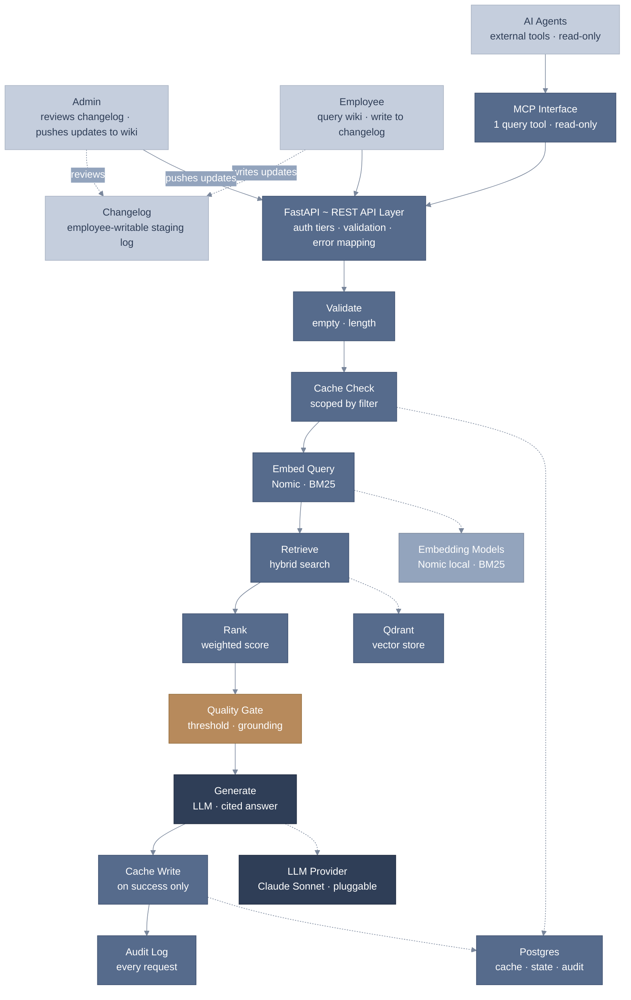

# RankedLM LLM Wiki

> LLM Wiki is the brain of the company ~ a single, scoped view into everything the company knows, running through one deterministic pipeline.

## What This Is

A production-grade RAG system that embeds a company's SOPs, policies, and operational procedures across key departments ~ Finance, Legal & Compliance, Travel, and Operations ~ and makes every one of them queryable in a single place.

This is Version 1: the reasoning engine at the core of the system, fully specced, built, and independently proven to work. Version 2 will add the layer that makes it usable by anyone, not just engineers ~ a single web interface where employees can query the wiki and log new or changed information directly into the changelog, which an admin reviews regularly and manually pushes into the live wiki ~ keeping the organization's shared knowledge current as the business evolves.

At its core, the system is deterministic, not purely generative. The LLM only writes the final answer text ~ every other step (what gets retrieved, whether a citation is real, whether the retrieved content is even good enough to answer from) is governed by fixed, rule-based logic, not model judgment. If retrieval quality falls below a set threshold, or a generated citation doesn't map back to a real source, the system automatically falls back to a safe, predictable response rather than letting the model improvise. It's also exposed to AI agents through a single, narrow MCP interface ~ read-only, so external tools can query the wiki without ever touching the underlying data directly.

In short: this is the beginning of an organization's own internal brain ~ a system that stores what the company knows, and retrieves it accurately, on demand.

## Why This Exists

Internal knowledge ~ SOPs, policies, thresholds ~ typically lives scattered across disconnected documents, folders, and tribal memory, forcing employees to manually dig through files every time they need an answer. Versions drift out of sync, conflicting numbers go unnoticed, and there's rarely a fast, reliable way to confirm an answer is actually grounded in real, current policy.

This system exists to bring all of that under one roof. Instead of searching, employees simply ask ~ in plain language ~ and get an answer sourced directly from the company's own real documents. The knowledge base itself stays current by design: an admin keeps it updated, so the answers employees receive always reflect what's actually true today, not what used to be true.

## How It Was Built

Built on LangGraph for orchestration, FastAPI for the API layer, Qdrant for vector search, Postgres for state/caching/audit, and Claude Sonnet for answer generation ~ with pluggable support for OpenAI and self-hosted models. After the initial build, the system went through a full independent evaluation stage before being considered done: a hand-verified golden dataset covering every core system behavior, a 29-test regression suite built on real production content, an adversarial security review, weekly automated drift detection, a CI/CD gate blocking any regression from shipping, and a live end-to-end test against the real running system.

Two safeguards sat at the center of that evaluation:

> Grounding checks verify every answer against its source before it ships ~ a citation must trace back to a real, retrieved document chunk, or the answer doesn't go out.

> Scope isolation ensures a question asked within one document category can never surface an answer meant for another ~ each query stays fully contained within its own scope, with no cached or retrieved content ever crossing a boundary it shouldn't.

The evaluation also included a real cost-quality comparison across LLM providers, run against the same four production questions: Claude Sonnet 4.6 scored 4/4 correct at $0.041 total, while GPT-5.6 Terra also scored 4/4 ~ with tighter, more precisely-scoped answers ~ at $0.015 total and 2~4x lower latency, roughly a third of the cost for equivalent accuracy.

## Architecture



## Setup

```bash
# 1. Clone and configure
git clone <repo-url> && cd llm_wiki
cp .env.example .env
# fill in LLM_API_KEY and any passwords you want changed from the placeholders

# 2. Start the stack (Postgres, Qdrant, App, MCP)
docker compose up -d

# 3. Run migrations (creates tables + the restricted runtime role)
docker compose run --rm app alembic upgrade head

# 4. Create an admin API key (printed once — save it and its key_id)
docker compose exec app python -m app.create_api_key --tier admin --actor "Your Name"

# 5. Upload your first document
curl -X POST http://localhost:8000/documents \
  -H "X-API-Key: <your-admin-key>" \
  -F "file=@/path/to/doc.md" \
  -F "title=My First SOP" \
  -F "source_label=hr"

# 6. Query it
curl -X POST http://localhost:8000/query \
  -H "X-API-Key: <your-admin-key>" \
  -H "Content-Type: application/json" \
  -d '{"question": "What does this document say?"}'

# 7. Connect an agent via MCP
# Point an MCP client at http://localhost:8001/sse with header X-API-Key: <a service/read key>
```

To revoke a compromised key later: `docker compose exec app python -m app.revoke_api_key --key-id <key_id>`.

Run the fast test suite any time with `./scripts/run_ci_tests.sh` (no live
Qdrant or LLM key needed, ~10-15s). The opt-in integration suite
(`RUN_GRAPH_INTEGRATION_TESTS=1`, needs live Postgres + Qdrant) exercises real
cross-system behavior; one test in it additionally calls the real Anthropic
API and costs real money — see its docstring in `tests/test_graph.py`.

## Evaluation Coverage

| Component | Status | Notes |
|---|---|---|
| Golden dataset | ✅ Covered | 8 hand-verified cases, one per core system behavior |
| Regression suite | ✅ Covered | 29 tests on real production content, including boundary values |
| Scope isolation | ✅ Covered | Cross-category leak found, fixed, and proven fixed |
| Adversarial case | ✅ Covered | A real cache-scoping bug, not a hypothetical |
| Grounding / citation check | ✅ Covered | Every citation verified to trace back to a real retrieved chunk ~ content-match verification is a documented trade-off, see Known Limitations |
| Tracing verification | ✅ Covered | LangSmith wiring proven live ~ full 8-node graph trace + LLM span captured for a real query |
| Drift check | ✅ Covered | Weekly automated re-run of the golden dataset, timestamped results |
| CI/CD gate | ✅ Covered | Full suite blocks any regression on every push and pull request |
| Live end-to-end test | ✅ Covered | All 4 real document categories, manually verified against the running system |
| Cost-quality comparison | ✅ Partial | Claude Sonnet vs GPT-5.6 Terra compared on real accuracy, latency, and cost. Embedding-model comparison not yet tested, see below |
| LLM-as-judge / judge bias check | N/A | The system uses a fixed numeric threshold, not an LLM judge |
| Human escalation / review queue | N/A | No escalation path exists in this system's design |

> *Note: Promptfoo was considered for eval orchestration, but pytest-based evals were chosen for tighter integration with the existing test suite and CI/CD gate.*

## Not Yet Tested

**Embedding-model comparison (Nomic vs BGE-large vs OpenAI).** Comparing an alternative embedding model properly means standing up a second, separate vector collection alongside the existing one ~ same documents, different model, different vector size, running side by side rather than replacing what's live. That's real, additional engineering work, not yet built.

**Real user-trust and answer-quality metrics.** Accuracy against a known-correct golden dataset proves the system works on paper; how real employees actually experience and trust the answers over time can only be measured with real usage, not simulated tests.

**Sustained load and concurrency at production scale.** The embedding-pileup bug found and fixed during this build was caught under artificial stress, not real traffic. Genuine production-scale concurrent usage is a different, larger test that hasn't been run.

**Broader adversarial and security review.** One real adversarial vulnerability (a cache-scoping leak) was found and fixed. A comprehensive red-team review against a wider range of real-world attack patterns is production-scale work, beyond what a single build-stage eval can cover.

## Known Limitations

**No front end yet.** Document upload, update, and deletion are all direct API calls — admin-only, fully technical. No interface exists yet for non-technical management.

**No changelog-writing interface yet.** Employees can currently only view the changelog. The intended v2 flow ~ employees writing updates directly into the changelog, with an admin reviewing it regularly and pushing accepted changes into the live wiki ~ is planned, not built.

**Citations point to a real source, but aren't double-checked against it.** Every citation links to a real, actual document ~ but the system doesn't confirm the answer's wording accurately reflects that source. A known trade-off: catching that would mean a second verification pass on every answer, adding real cost and latency ~ the fix itself is a simple wire-up.

## V2 Roadmap

- Conversational memory
- Batch document ingestion
- Streaming answers
- Prompt caching
- CSV / Excel / HTML support
- Browser front end + CORS
- Employee changelog-writing interface, with admin review and push into the live wiki
- Loop engineering ~ automatic retry (rephrase + re-retrieve) when the first attempt isn't confident, instead of degrading immediately
